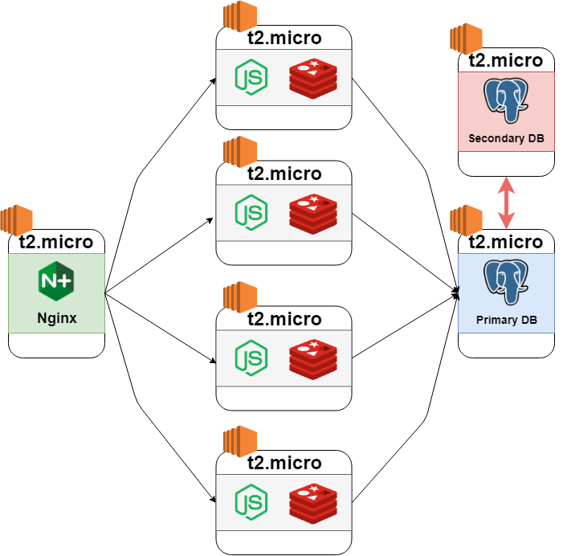

# Nordstrom System Design
> Scaled up on AWS EC2 instances



Result: 4500 request per second within 0.1 % of error rate

- Inherited front-end codebase and scaled up on AWS EC2 instances
- Populated 10M fake product data with Node.js Streams and seeded on Postgres
- Benchmarked MongoDB and Postgres, and got a better result with Postgres in terms of latency and error rate under high traffic
- Optimized Nginx on Ubuntu with the least connection algorithm
- Implemented DB replica set to handle 4500 request per second within 0.1 % of error rate

## Related Projects

* [Kathleen - Product sections](https://github.com/hrla29-targaryen-sdc/product-description)
* [Calvin - Detail sections](https://github.com/calvin197/SDC-Service-Server)
* [Ramin - Review sections](https://github.com/hrla29-targaryen-sdc/reviews)

### Usage

```
git clone https://github.com/april9288/nav.git
cd nav
npm install
npm start
```

### Requirements

You need to install Nodejs.

### Development Tools

* [react.js](https://www.npmjs.com/package/react) - The official React.js website
* [express.js](https://www.npmjs.com/package/express) - The official Express.js website
* [webpack 4](https://www.npmjs.com/package/webpack) - The official Webpack website

## Meta Data

James Jongho Kim 
- [Github](https://github.com/april9288) - This is my Github page


